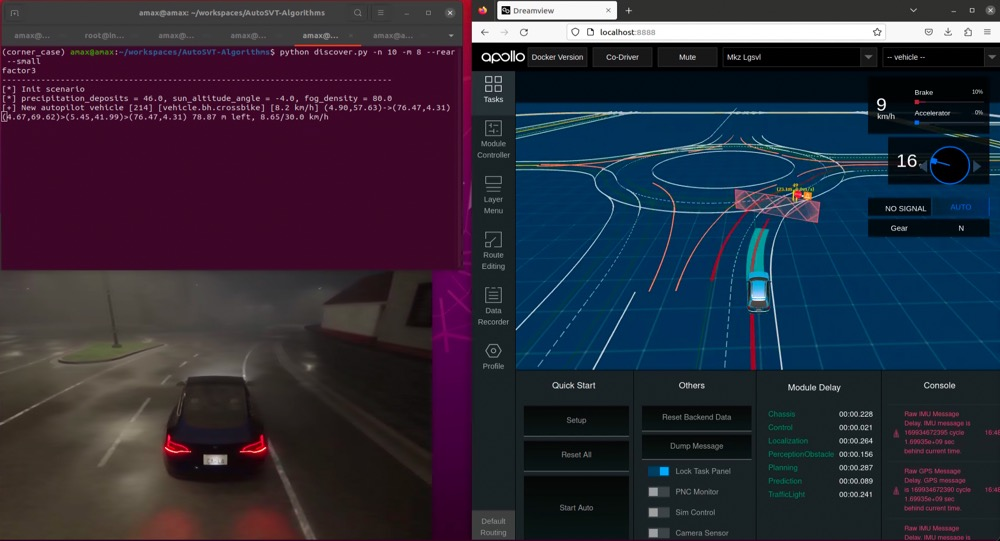

# \[AutoSVT\] Corner Case Discovery Algorithm 
This project presents a meta-heuristic algorithm aimed at discovering corner cases for autonomous driving systems within a simulator. It is designed based on several empirical insights, which provide guidance for both seed scenarios and mutations. This significantly reduces the search dimensions of scenarios and enhances the efficiency of corner case discovery, especially in adverse weather conditions.

Please visit [AutoSVT](https://idslab-autosec.github.io/) for more information.

## Installation
1. Install the AutoSVT-Carla Python package. Please refer to [AutoSVT-Bridge](https://github.com/idslab-autosec/AutoSVT-Carla-Apollo-Bridge) for instructions.
2. Install scipy.
    ```bash
    pip install scipy
    ```


## Getting Started
Run CARLA, Apollo and bridge. For detailed steps, please refer to [AutoSVT-Bridge](https://github.com/idslab-autosec/AutoSVT-Carla-Apollo-Bridge).

### Discovering corner cases
You can use `discover.py` to discover new corner cases, and for information on the relevant parameters, please check `discover.py -h`.

```bash
python discover.py -n 10 -m 8 --rear --small
```


After running `discover.py`, the discovered corner cases will be stored in JSON format in the `output/` directory, which includes scenario information and mutation history.

### Corner cases reproduction
The corner cases we've already found are stored in `corner_case/`, and you can reproduce these corner cases using `replay.py`.

```bash
python replay.py [FILE]
```

## Acknowledgments
This project is based on the framework of [DriveFuzz](https://gitlab.com/s3lab-code/public/drivefuzz).